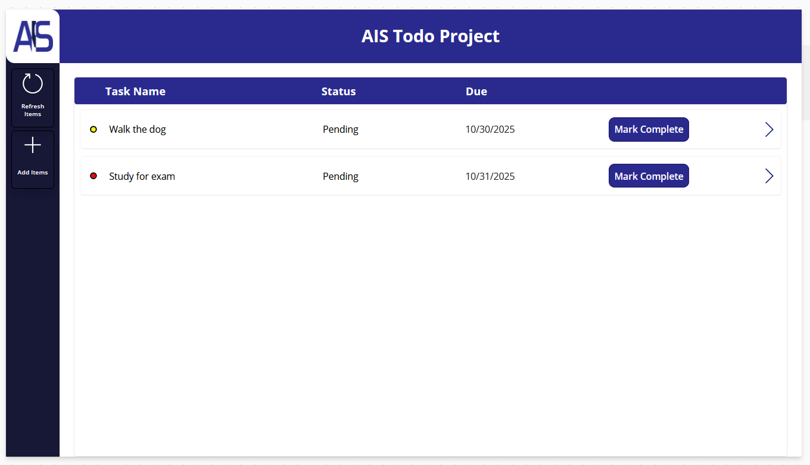

# Power Apps To-Do List

## Overview
This is an interactive To-Do List application built with **Microsoft Power Apps**.  
The app allows users to add, edit, complete, and delete tasks, providing a simple and user-friendly interface for managing daily tasks.

## Features
- Add new tasks with titles and optional descriptions  
- Mark tasks as completed or pending  
- Edit or delete tasks  
- Interactive and responsive UI for mobile and desktop  
- Demonstrates basic Power Apps functionality, including galleries, forms, and buttons  

## How to Use
1. Download the `.msapp` file included in this repository.  
2. Open [Power Apps](https://make.powerapps.com/).  
3. Import the app via **Apps → Import canvas app → Upload `.msapp` file**.  
4. Launch the app and start managing your tasks.

## File Contents
- `ToDoList.msapp` — the Power Apps project file  
- `README.md` — this documentation  

## Screenshots

